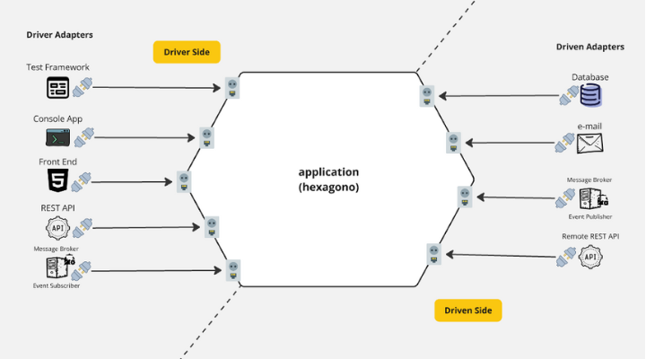
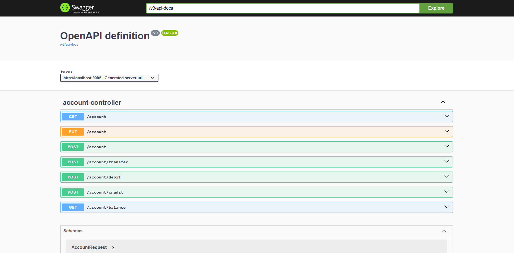

# Bank App

End-to-end sample of a bank system built with a hexagonal architecture. The project separates domain logic (hexagon) from driving (REST) and driven (database) adapters while keeping the domain free from framework annotations.

## Table of contents
- [Architecture](#architecture)
- [Modules](#modules)
- [API](#api)
- [Running locally](#running-locally)
- [Future improvements](#future-improvements)

## Architecture
The solution follows a ports-and-adapters layout. The hexagon exposes ports that are consumed by adapters (REST as driving; persistence as driven). Domain entities and services remain POJOs to keep framework-agnostic behavior and respect SOLID.



## Modules
- **bank-parent**: Maven BOM/parent that centralizes dependency management (Java 17, Spring Boot 3.3.5, Lombok) and versions for every module.
- **bank-hexagon**: Domain and application core. Contains entities (e.g., `Account`), value objects (`Limit`), ports, and services implementing business rules (credit, debit, transfer, balance validation) without Spring annotations.
- **bank-api**: Driving adapter exposing REST endpoints. Maps HTTP payloads to domain DTOs (`AccountRequest` -> `AccountDTO`) and delegates to the hexagon via application services. Bundles Swagger/OpenAPI UI and depends on a chosen persistence adapter.
- **bank-h2-adapter**: Driven adapter backed by H2. Implements persistence ports using H2-specific configuration; useful for local/dev without external DB.
- **bank-mysql-adapter**: Driven adapter backed by MySQL. Implements persistence ports with MySQL dialect and configuration.

### Selecting a database adapter
`bank-api` currently depends on `bank-mysql-adapter`. To switch to H2, change the dependency in `bank-api/pom.xml` (replace `bank-mysql-adapter` with `bank-h2-adapter`) and align the datasource properties in `bank-api` `application.yaml`.

## API
Interactive docs: start the app and open Swagger UI (see `docs/routes.png`).



### Endpoints and examples

| Method | Path | Params/Body | Description |
| --- | --- | --- | --- |
| `GET` | `/account` | `id` (query, UUID) | Fetch an account by id. |
| `POST` | `/account` | JSON body | Create an account. |
| `PUT` | `/account` | JSON body | Update an account. |
| `POST` | `/account/transfer` | `from` (UUID), `to` (UUID), `amount` (number) | Transfer balance between accounts. |
| `POST` | `/account/credit` | `id` (UUID), `amount` (number) | Credit funds to an account. |
| `POST` | `/account/debit` | `id` (UUID), `amount` (number) | Debit funds from an account. |
| `GET` | `/account/balance` | `id` (UUID) | Get account balance. |

**Sample request body - create account**
```json
{
  "id": null,
  "bank": "ITAÚ",
  "branch": "1234",
  "accountNumber": "00001234",
  "balance": 1500.75,
  "accountHolderId": null,
  "limit": "2000,5000,2000",
  "active": true
}
```

**Typical account response**
```json
{
  "id": "20a6f29f-7ff5-4c44-bab7-f4a13f819d25",
  "bank": "ITAÚ",
  "branch": "1234",
  "accountNumber": "00001234",
  "balance": 1500.75,
  "accountHolderId": "22b154b0-2e92-49a1-b83e-e0ebb6c058e2",
  "limit": "Limit[dailyTransactionLimit=2000.0, dailyTransferLimit=5000.0, dailyWithdrawalLimit=2000.0]",
  "active": true
}
```

**Transfer (query parameters example)**
```
/account/transfer?from=d9f1c2ab-1234-4cde-8f90-abcdef123456&to=1b2c3d4e-5678-90ab-cdef-1234567890ab&amount=250.00
```

### Validation highlights
The hexagon enforces business rules (e.g., bank/branch/account number length, non-negative balance, non-null limits). Adapters should pass complete, validated data into the domain via mappers rather than bypassing domain constructors or services.

## Running locally
Prerequisites: JDK 17+, Maven 3.9+.

Build all modules from the root aggregator:
```bash
mvn clean install
```

Run the API (uses the selected adapter dependency in `bank-api`):
```bash
cd bank-api
mvn spring-boot:run
```

Swagger UI: `http://localhost:8080/swagger-ui.html`

## Future improvements
- [ ] Create an `AccountHolder` entity to store holder details.
- [ ] Split multi-action ports into focused use cases (e.g., `CreateAccount`, `Deposit`, `Withdraw`) to align with SOLID.
- [ ] Make `Account` the aggregate root for a dedicated `AccountRepository` supporting aggregate persistence and retrieval.
